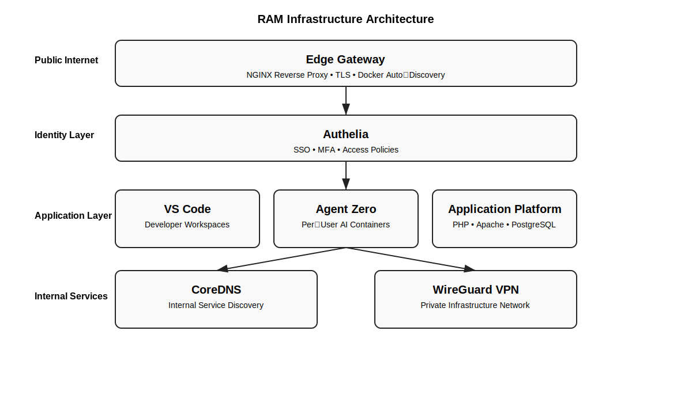
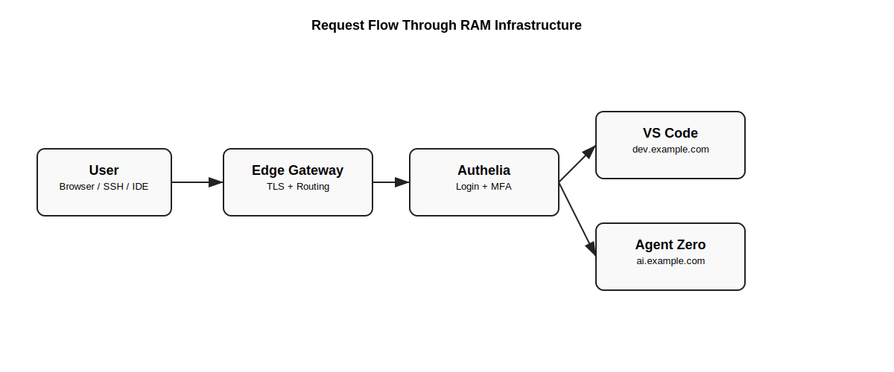

# 🐏 RAM

### Production-Grade Infrastructure as Code

Secure • Repeatable • Multi-Tenant • Hardened by Default

Ansible-powered infrastructure platform for deploying secure developer environments, AI platforms, and application stacks using Docker.

Built for **Ubuntu 24.04** and designed for **real-world production systems**.

 

 

### Infrastructure Capabilities

| Feature | Description |
|------|------|
| 🔐 Edge Gateway | Automatic routing, TLS, container discovery |
| 🔑 Identity Layer | Authelia SSO + MFA |
| 🌐 Internal DNS | CoreDNS over WireGuard |
| 🔒 Private Network | WireGuard infrastructure VPN |
| 🧑‍💻 Dev Environments | Multi-tenant VS Code containers |
| 🧠 AI Platforms | Isolated Agent Zero environments |
| 🚀 Application Platform | PHP / Apache / PostgreSQL stacks |

 

### Architecture Overview

 

### Request Flow

 

**Powered by Rwabigimbo**

---

 
RAM infrastructure is organized into layered components.

Internet
│
▼
Edge Gateway (NGINX + TLS + Auto Discovery)
│
▼
Authelia (SSO + MFA)
│
▼
Application Layer
├─ VS Code (multi-tenant)
├─ Agent Zero (multi-tenant)
└─ Application Platform
│
▼
CoreDNS (internal DNS)
│
▼
WireGuard VPN

This architecture allows secure multi-tenant infrastructure with minimal manual configuration.
---

# What is RAM
**RAM** is a curated infrastructure repository designed for **production-grade deployments**, not demo stacks.

It combines:
| Layer | Technology |
|-----|------|
| Infrastructure Control | Ansible |
| Runtime | Docker |
| Edge Gateway | NGINX |
| Authentication | Authelia |
| Internal DNS | CoreDNS |
| Private Network | WireGuard |

This approach provides:
- reproducible infrastructure
- secure defaults
- automated service discovery
- multi-tenant service isolation
- simplified operations

RAM eliminates:
- snowflake servers
- undocumented infrastructure decisions
- fragile manual deployments
- security-last configurations

Infrastructure becomes **version-controlled and repeatable**.

---

# Core Infrastructure Stacks
## 🔐 Edge Gateway
The **Edge Gateway** is the entry point for all services.

Built with:
- NGINX
- Certbot
- Edge Watcher (Docker label discovery)

Features:
- automatic TLS certificates
- container auto-discovery
- dynamic routing
- zero-downtime configuration reload

Services become publicly accessible by adding Docker labels:
edge.enable=true
edge.domain=service.example.com
edge.port=80

The watcher automatically generates NGINX routing.

---

## 🔑 Authelia
Authelia provides centralized authentication.

Capabilities:
- Single Sign-On
- Multi-Factor Authentication
- session management
- domain access policies

NGINX integrates using:
auth_request

This protects applications without modifying the application containers.

---

## 🌐 CoreDNS

CoreDNS provides **internal service discovery** through the VPN.

Wildcard zones resolve automatically:
*.dev.example.com
*.ai.example.com

Example internal services:
alice.dev.example.com
alice.ai.example.com

All internal domains resolve to the **edge gateway IP**.

---

## 🔒 WireGuard

WireGuard provides the private infrastructure network.

Example subnet:
10.8.0.0/24

Used for:

- SSH administration
- internal DNS
- secure service access

Example SSH:

ssh ubuntu@10.8.0.1

---

# Multi-Tenant Platforms

## VS Code Server

Each user receives a private development container.

Example domain:

alice.dev.example.com

Features:

- persistent workspace
- isolated container
- Authelia authentication
- automatic edge routing

---

## Agent Zero

Agent Zero provides isolated AI environments.

Example domain:

alice.ai.example.com

Each user receives:

- dedicated container
- persistent storage
- Authelia protection
- automated routing

---

## Application Platform

RAM also supports application deployments.

Example stack:

- Apache 2.4
- PHP 8.2
- PostgreSQL 17 + PostGIS
- Docker container builds

Applications integrate automatically with the edge gateway.

---

# Deployment Workflow

## 1️⃣ Configure Secrets

Copy the vault template:

cp ansible/group_vars/all/vault.yml.example ansible/group_vars/all/vault.yml

Encrypt the vault:

ansible-vault encrypt ansible/group_vars/all/vault.yml

Vault stores:

- WireGuard peers
- Authelia secrets
- Agent Zero credentials
- VS Code passwords

---

## 2️⃣ Deploy Infrastructure

Recommended order:

ansible-playbook ansible/playbooks/01-docker.yml

ansible-playbook ansible/playbooks/02-edge-gateway.yml

ansible-playbook ansible/playbooks/05-wireguard.yml --ask-vault-pass

ansible-playbook ansible/playbooks/03a-coredns.yml

ansible-playbook ansible/playbooks/03-vscode.yml

ansible-playbook ansible/playbooks/06-authelia.yml --ask-vault-pass

ansible-playbook ansible/playbooks/07-agent-zero.yml --ask-vault-pass

---

# WireGuard Client Management

Clients can be created automatically.

Example:

ansible-playbook ansible/playbooks/09-wireguard-peer.yml
-e wg_peer_action=add
-e wg_peer_name=laptop1
--ask-vault-pass

Client configs are generated under:

ansible/artifacts/wireguard/

Import the config into your WireGuard client.

---

# Rolling Upgrades

Agent Zero supports safe rolling upgrades.

ansible-playbook ansible/playbooks/08-agent-zero-upgrade.yml
--ask-vault-pass
-e agent_zero_target_image='agent0ai/agent-zero:latest'

Automatic backups are created:

/opt/agent-zero/backups/<user>/a0usr-<timestamp>.tar.gz

---

# Security Model

RAM uses layered security.

### Network

- WireGuard VPN
- UFW firewall
- Docker network isolation

### Identity

- Authelia SSO
- MFA authentication

### Runtime Isolation

- per-user containers
- hardened NGINX
- minimal container privileges

---

# Repository Structure

ram/
│
├── ansible/
│ ├── playbooks/
│ ├── roles/
│ ├── inventory/
│ └── group_vars/
│
├── docs/
│ ├── ram-system-architecture.svg
│ └── ram-request-flow.svg
│
├── artifacts/
│ └── wireguard/
│
└── README.md

---

# Operational Commands

Check containers:

docker ps

Check edge watcher:

docker logs edge-watcher

Check VPN status:

sudo wg show

Check TLS certificates:

ls /opt/edge-gateway/certbot/conf/live

---

# Infrastructure Philosophy

RAM follows strict infrastructure principles.

- secure by default
- minimal but complete
- infrastructure is documentation
- reproducible deployments
- production before convenience

---

# Roadmap

Future expansions include:

- Kubernetes deployment patterns
- observability stacks
- CI/CD pipelines
- distributed AI infrastructure
- edge compute platforms

All following the same **production-grade discipline**.

---

### Built with discipline. Hardened by default.

**Powered by Rwabigimbo**

