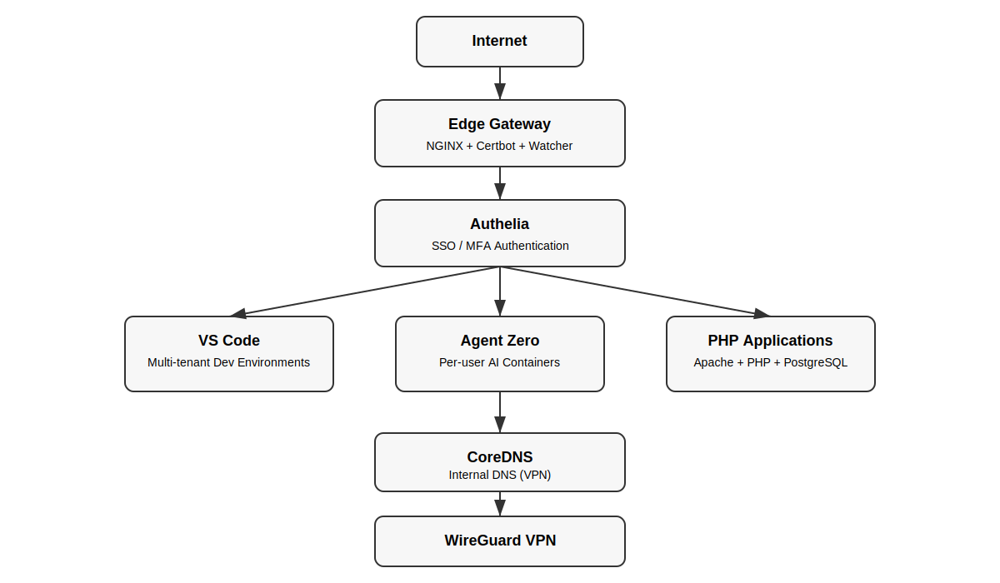

# 🐏 RAM
### Production-Grade Infrastructure as Code

**Opinionated • Secure • Repeatable • Hardened by Default**

Ansible-powered deployment stacks for Docker edge gateways, developer environments, and modern application platforms.

Built for **Ubuntu 24.04** and **real-world production systems**.

 

 

**Powered by Rwabigimbo**

---

# Table of Contents

- [Architecture](#architecture)
- [What is RAM](#what-is-ram)
- [Core Stacks](#core-stacks)
- [Deployment Workflow](#deployment-workflow)
- [Multi-Tenant Services](#multi-tenant-services)
- [Security Model](#security-model)
- [Repository Structure](#repository-structure)
- [Operational Commands](#operational-commands)
- [Roadmap](#roadmap)
- [Philosophy](#philosophy)

---

# Architecture

The platform uses a layered architecture designed for **secure multi-tenant infrastructure**.

Internet
│
▼
Edge Gateway (NGINX)
│
▼
Authelia SSO / MFA
│
▼
Application Layer
├── VS Code (multi-tenant)
├── Agent Zero (multi-tenant)
└── PHP Applications
│
▼
CoreDNS (VPN internal DNS)
│
▼
WireGuard VPN

---

# What is RAM

**Ram** is a curated infrastructure repository focused on **production-ready deployment patterns**.

It combines:

- **Ansible** → infrastructure control plane
- **Docker** → service runtime
- **NGINX Edge Gateway** → traffic routing
- **WireGuard VPN** → secure network
- **Authelia** → authentication layer
- **CoreDNS** → internal service discovery

to provide a **secure, automated platform for modern development infrastructure**.

Ram eliminates:

- snowflake servers
- undocumented infrastructure decisions
- fragile copy-paste stacks
- security-last configurations

Infrastructure becomes **version-controlled and reproducible**.

---

# Core Stacks

## 🔐 Edge Gateway

Production reverse proxy built with:

- NGINX
- Certbot
- Edge Watcher (auto discovery)

Features:

- automatic TLS
- container discovery via Docker labels
- dynamic routing
- zero-downtime reload

Containers labeled with:

edge.enable=true

are automatically exposed through the gateway.

---

## 🔑 Authelia

Identity and authentication layer.

Features:

- Single Sign-On
- Multi-Factor Authentication
- centralized login portal
- dynamic domain protection

NGINX integrates using:

auth_request

which protects applications **without modifying application containers**.

---

## 🌐 CoreDNS

Internal DNS resolver available only through the VPN.

Resolves:

*.dev.unifypesacard.shop
*.a0.unifypesacard.shop

Example:

alice.dev.unifypesacard.shop
alice.a0.unifypesacard.shop

All internal domains resolve to the **edge gateway**.

---

## 🔒 WireGuard

Provides secure private infrastructure access.

VPN network:

10.8.0.0/24

Used for:

- private SSH
- internal DNS
- secure admin access

Example connection:

ssh ubuntu@10.8.0.1

---

# Multi-Tenant Services

## VS Code (code-server)

Each user receives a private development container.

Example:

alice.dev.unifypesacard.shop

Features:

- persistent workspace
- isolated environment
- Authelia authentication
- automatic routing

---

## Agent Zero

Private AI environments deployed per user.

Example:

alice.a0.unifypesacard.shop

Each user receives:

- isolated container
- dedicated storage
- Authelia protected access

---

## PHP Application Platform

Example stack:

- Apache 2.4
- PHP 8.2
- PostgreSQL 17 + PostGIS
- Docker build pipeline

Applications integrate with the edge gateway using Docker labels.

---

# Deployment Workflow

## 1. Configure Secrets

cp ansible/group_vars/all/vault.yml.example ansible/group_vars/all/vault.yml
ansible-vault encrypt ansible/group_vars/all/vault.yml

Vault stores:

- WireGuard peers
- Authelia secrets
- Agent Zero credentials
- VS Code passwords

---

## 2. Deploy Infrastructure

ansible-playbook ansible/playbooks/01-docker.yml
ansible-playbook ansible/playbooks/02-edge-gateway.yml
ansible-playbook ansible/playbooks/05-wireguard.yml --ask-vault-pass
ansible-playbook ansible/playbooks/03a-coredns.yml
ansible-playbook ansible/playbooks/03-vscode.yml
ansible-playbook ansible/playbooks/06-authelia.yml --ask-vault-pass
ansible-playbook ansible/playbooks/07-agent-zero.yml --ask-vault-pass

---

## 3. Generate WireGuard Clients

Peer configs are generated automatically and stored in:

ansible/artifacts/wireguard/<peer>.conf

Import these files into the WireGuard client.

---

## 4. Rolling Upgrades

Upgrade Agent Zero safely:

ansible-playbook ansible/playbooks/08-agent-zero-upgrade.yml
--ask-vault-pass
-e agent_zero_target_image='agent0ai/agent-zero:latest'

Backups are created automatically:

/opt/agent-zero/backups/<user>/a0usr-<timestamp>.tar.gz

---

# Security Model

Ram enforces security at multiple layers.

## Network

- WireGuard VPN
- UFW firewall
- Docker network isolation

## Identity

- Authelia SSO
- Multi-factor authentication

## Runtime Isolation

- per-user containers
- hardened NGINX configuration
- read-only infrastructure containers

---

# Repository Structure

ram/
│
├── ansible/
│ ├── playbooks/
│ ├── roles/
│ ├── inventory/
│ └── group_vars/
│
├── docs/
│ └── ram-architecture.svg
│
├── artifacts/
│ └── wireguard/
│
└── README.md

---

# Operational Commands

Check containers:

docker ps

Check edge watcher:

docker logs edge-watcher

Check VPN:

sudo wg show

Check TLS certificates:

ls /opt/edge-gateway/certbot/conf/live

---

# Philosophy

Ram follows strict infrastructure principles:

- secure by default
- minimal but complete
- infrastructure is documentation
- no hidden magic
- production before convenience

---

# Roadmap

Ram will expand into:

- Kubernetes infrastructure
- observability stacks
- CI/CD pipelines
- data platforms
- distributed AI infrastructure
- edge compute

All with the same **production discipline**.

---

### Built with discipline. Hardened by default.

**Powered by Rwabigimbo**

